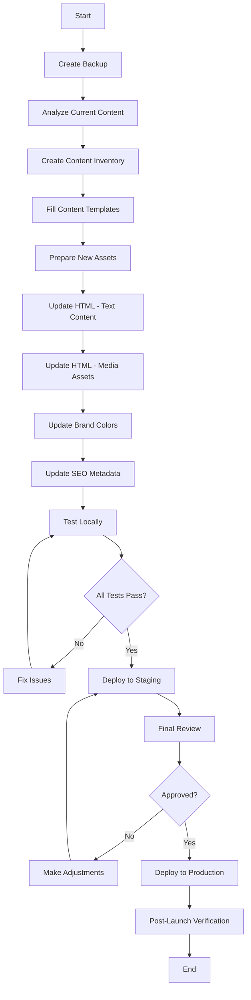

# Design Document - Website Content Replacement

## Overview

Tài liệu thiết kế này mô tả cách tiếp cận có hệ thống để thay đổi toàn bộ nội dung của website Ramos hiện tại thành nội dung cho một công ty mới. Giải pháp bao gồm việc phân tích, lập kế hoạch, tạo template, và cung cấp quy trình thực thi để đảm bảo không bỏ sót bất kỳ nội dung nào.

## Architecture

### High-Level Architecture

```
┌─────────────────────────────────────────────────────────────┐
│                    Content Replacement System                │
├─────────────────────────────────────────────────────────────┤
│                                                               │
│  ┌──────────────┐    ┌──────────────┐    ┌──────────────┐  │
│  │   Analysis   │───▶│   Planning   │───▶│  Execution   │  │
│  │    Phase     │    │    Phase     │    │    Phase     │  │
│  └──────────────┘    └──────────────┘    └──────────────┘  │
│         │                    │                    │          │
│         ▼                    ▼                    ▼          │
│  ┌──────────────┐    ┌──────────────┐    ┌──────────────┐  │
│  │  Content     │    │  Templates   │    │  Validation  │  │
│  │  Inventory   │    │  & Mapping   │    │  & Testing   │  │
│  └──────────────┘    └──────────────┘    └──────────────┘  │
│                                                               │
└─────────────────────────────────────────────────────────────┘
```

### Directory Structure

```
.
├── .kiro/
│   └── specs/
│       └── website-content-replacement/
│           ├── requirements.md
│           ├── design.md
│           ├── tasks.md
│           └── content-plan/
│               ├── 01-content-inventory.md
│               ├── 02-content-mapping.json
│               ├── 03-text-content-template.md
│               ├── 04-media-assets-list.md
│               ├── 05-brand-identity-guide.md
│               ├── 06-seo-metadata-template.md
│               ├── 07-replacement-checklist.md
│               └── 08-implementation-guide.md
├── backup/
│   ├── original-website/
│   │   ├── index.htm
│   │   └── [all original assets]
│   └── backup-date.txt
└── new-content/
    ├── images/
    │   ├── logo/
    │   ├── hero/
    │   ├── features/
    │   └── icons/
    ├── videos/
    └── content-ready.json
```

## Components and Interfaces

### 1. Content Analysis Component

**Purpose:** Phân tích website hiện tại và tạo inventory đầy đủ

**Input:**
- index.htm file
- Asset directories (images, videos, CSS, JS)

**Output:**
- Content inventory document (Markdown)
- JSON mapping file

**Key Functions:**
```javascript
{
  "analyzeTextContent": {
    "description": "Trích xuất tất cả text content từ HTML",
    "returns": "Array of text elements with selectors"
  },
  "analyzeMediaAssets": {
    "description": "Liệt kê tất cả media files và metadata",
    "returns": "Array of media assets with paths and dimensions"
  },
  "analyzeBrandElements": {
    "description": "Xác định brand colors, fonts, logos",
    "returns": "Brand identity object"
  },
  "analyzeSEOMetadata": {
    "description": "Trích xuất tất cả SEO tags",
    "returns": "SEO metadata object"
  }
}
```

### 2. Content Inventory Document

**Structure:**

```markdown
# Content Inventory

## 1. Text Content

### Hero Section
- **Location:** `.hero-sc .headline-h1`
- **Current:** "Analytics that helps you shape the future"
- **Type:** Main headline
- **Character count:** 42
- **New content:** [TO BE FILLED]

### Navigation Menu
- **Location:** `.nav-link[data-navlink="1"]`
- **Current:** "Key Features"
- **New content:** [TO BE FILLED]

[... continues for all text elements]

## 2. Media Assets

### Logo
- **File:** `669a3911a488f72cbabca56d/669a3c1a57c3b0f5c2f3036b_faviocn.png`
- **Type:** Favicon
- **Dimensions:** 32x32px
- **Format:** PNG
- **New file:** [TO BE PROVIDED]

[... continues for all media]

## 3. Brand Colors
- **Primary:** #FE4A23 (Orange)
- **Usage:** Buttons, accents, CTAs
- **New color:** [TO BE DEFINED]

## 4. Contact Information
- **Email:** hello@ramos.com
- **New email:** [TO BE PROVIDED]
```

### 3. Content Mapping System

**JSON Structure:**

```json
{
  "metadata": {
    "projectName": "Website Content Replacement",
    "oldCompany": "Ramos",
    "newCompany": "[TO BE FILLED]",
    "dateCreated": "2025-11-15",
    "version": "1.0"
  },
  "textContent": {
    "hero": {
      "mainHeadline": {
        "selector": ".hero-sc .headline-h1",
        "old": "Analytics that helps you shape the future",
        "new": "",
        "status": "pending",
        "priority": "high"
      },
      "description": {
        "selector": ".hero-sc .body-b2",
        "old": "Ready for exciting, instantaneous...",
        "new": "",
        "status": "pending",
        "priority": "high"
      }
    },
    "navigation": {
      "item1": {
        "selector": "[data-navlink='1']",
        "old": "Key Features",
        "new": "",
        "status": "pending",
        "priority": "medium"
      }
    }
  },
  "mediaAssets": {
    "logo": {
      "favicon": {
        "oldPath": "669a3911a488f72cbabca56d/669a3c1a57c3b0f5c2f3036b_faviocn.png",
        "newPath": "",
        "dimensions": "32x32",
        "format": "png",
        "status": "pending",
        "priority": "high"
      },
      "mainLogo": {
        "oldPath": "SVG inline in HTML",
        "newPath": "",
        "type": "svg",
        "status": "pending",
        "priority": "high"
      }
    },
    "heroVideo": {
      "oldPath": "s/87iozgh1s9pw46j3cn49i/ramos-promo-half.mp4",
      "newPath": "",
      "format": "mp4",
      "status": "pending",
      "priority": "high"
    }
  },
  "brandIdentity": {
    "companyName": {
      "old": "Ramos",
      "new": "",
      "occurrences": []
    },
    "colors": {
      "primary": {
        "old": "#FE4A23",
        "new": "",
        "usage": ["buttons", "accents", "links"]
      }
    },
    "fonts": {
      "primary": {
        "old": "Urbanist",
        "new": "",
        "weights": [100, 200, 300, 400, 500, 600, 700, 800, 900]
      }
    }
  },
  "seoMetadata": {
    "title": {
      "old": "Ramos",
      "new": "",
      "status": "pending"
    },
    "ogTitle": {
      "old": "Ramos",
      "new": "",
      "status": "pending"
    },
    "ogImage": {
      "old": "https://cdn.prod.website-files.com/669a3911a488f72cbabca56d/66e2a2f99cd9c144f25d469f_Opengraph.png",
      "new": "",
      "status": "pending"
    }
  },
  "contactInfo": {
    "email": {
      "old": "hello@ramos.com",
      "new": "",
      "locations": [".menu-mail"]
    }
  }
}
```

### 4. Template System

#### Text Content Template

```markdown
# Text Content Template

## Instructions
Điền nội dung mới vào cột "New Content". Giữ độ dài tương tự với nội dung cũ để đảm bảo layout không bị vỡ.

## Hero Section

| Element | Current Content | Character Count | New Content | Notes |
|---------|----------------|-----------------|-------------|-------|
| Main Headline | Analytics that helps you shape the future | 42 | | Keep similar length |
| Sub Description | Ready for exciting, instantaneous, all-accessible insights in real time? | 79 | | Can be longer/shorter |

## Key Features Section

| Element | Current Content | New Content | Notes |
|---------|----------------|-------------|-------|
| Section Title | Your key to strategic success through analytics | | |
| Feature 1 Title | Fast and easy access to analytics | | |
| Feature 1 Description | One platform is a comprehensive system... | | |

## Navigation Menu

| Item | Current | New | Link Target |
|------|---------|-----|-------------|
| Item 1 | Key Features | | #key-features |
| Item 2 | Explore | | #explore |
| Item 3 | Solutions | | #solutions |
| Item 4 | Tools | | #tools |
| Item 5 | Contact | | #contact |

## Contact Information

| Type | Current | New |
|------|---------|-----|
| Email | hello@ramos.com | |
| Company Name | Ramos | |
```

#### Media Assets Specification

```markdown
# Media Assets Specification

## Logo Assets

### Favicon
- **Current file:** 669a3c1a57c3b0f5c2f3036b_faviocn.png
- **Dimensions:** 32x32px
- **Format:** PNG
- **New file path:** new-content/images/logo/favicon.png
- **Status:** ⬜ Not started

### Webclip (Apple Touch Icon)
- **Current file:** 669a3c1d835c44b0a97cee7a_webclip.png
- **Dimensions:** 180x180px (recommended)
- **Format:** PNG
- **New file path:** new-content/images/logo/webclip.png
- **Status:** ⬜ Not started

### Main Logo SVG
- **Location:** Inline SVG in header
- **Type:** Vector logo
- **Colors:** Uses currentColor (inherits from CSS)
- **New file path:** new-content/images/logo/main-logo.svg
- **Status:** ⬜ Not started

## Hero Section Assets

### Hero Video
- **Current file:** ramos-promo-half.mp4
- **Estimated dimensions:** 1920x1080 or similar
- **Format:** MP4
- **Duration:** Unknown (analyze current video)
- **New file path:** new-content/videos/hero-video.mp4
- **Status:** ⬜ Not started
- **Notes:** Video should be optimized for web, consider compression

### Hero Sticker Animations
- **Type:** Lottie JSON animations
- **Files:**
  - vidget22.json
  - vidget23.json
  - vidget24.json
- **New files:** Can keep or replace with new animations
- **Status:** ⬜ Decide whether to keep or replace

## Feature Section Assets

### Widget Images
- **ipad.svg** - iPad mockup
- **ipad-elements-top.png** - UI elements
- **phone-elements-top.png** - Phone UI elements
- **card-grid.png** - Card layout
- **mobile-grid-p.png** - Mobile grid
- **widget-statistic.svg** - Statistics widget
- **form-banner.png** - Form banner
- **fomr-ipad.png** - Form on iPad

**Action required:** Decide which images to replace or keep

## Avatar/Profile Images
- avatar-2435.jpg
- avatar-2436.jpg
- video-cover.jpg

**Action required:** Replace with new team photos or testimonial images

## Background Images
- ramos-bg.jpg
- cta-icon-bg.png

**Action required:** Replace or update with new brand colors

## Icons and Graphics
- ramos.svg - Company icon
- Various SVG icons inline in HTML

**Action required:** Update colors to match new brand
```

### 5. Brand Identity Guide

```markdown
# Brand Identity Replacement Guide

## Current Brand: Ramos

### Colors
- **Primary Orange:** #FE4A23
  - Used in: Buttons, links, accents, icons
  - CSS locations: Inline styles, .button-circle.orange, various SVG fills
  
- **White:** #FFFFFF
  - Used in: Text on dark backgrounds, button text
  
- **Grey:** Various shades
  - Light grey for backgrounds
  - Dark grey for secondary text

### Typography
- **Font Family:** Urbanist
- **Weights used:** 100, 200, 300, 400, 500, 600, 700, 800, 900
- **Loaded from:** Google Fonts

### Logo
- **Type:** Abstract geometric logo with "Ramos" text
- **Format:** SVG (scalable)
- **Colors:** Uses currentColor property

## New Brand: [TO BE FILLED]

### Colors
- **Primary Color:** [HEX CODE]
  - Will replace: #FE4A23
  - Update locations:
    - [ ] CSS variables (if any)
    - [ ] Inline styles
    - [ ] SVG fill colors
    - [ ] Button backgrounds
    
- **Secondary Color:** [HEX CODE]
- **Text Color:** [HEX CODE]
- **Background Color:** [HEX CODE]

### Typography
- **Font Family:** [FONT NAME]
- **Weights needed:** [LIST]
- **Source:** Google Fonts / Custom / System

### Logo
- **Format:** SVG (recommended) or PNG
- **Variations needed:**
  - Main logo (header)
  - Favicon (32x32px)
  - Webclip (180x180px)
  - Social media (1200x630px for OG image)

## Color Replacement Strategy

### Method 1: Find and Replace in HTML
```bash
# Find all occurrences of old color
grep -r "#FE4A23" index.htm

# Replace with new color (manual or script)
sed -i 's/#FE4A23/#NEW_COLOR/g' index.htm
```

### Method 2: CSS Variables (Recommended for future)
```css
:root {
  --primary-color: #FE4A23;
  --secondary-color: #FFFFFF;
}

/* Then use var(--primary-color) throughout */
```

### Method 3: External CSS File
- Extract all color definitions to separate CSS file
- Update colors in one place
- Link to HTML

## Font Replacement

### Current Implementation
```html
<script src="ajax/libs/webfont/1.6.26/webfont.js"></script>
<script>
WebFont.load({
  google: {
    families: ["Urbanist:100,200,300,regular,500,600,700,800,900"]
  }
});
</script>
```

### Update Steps
1. Change font family name in WebFont.load()
2. Update CSS font-family declarations
3. Test all text elements for proper rendering
4. Adjust font weights if needed
```

### 6. SEO Metadata Template

```markdown
# SEO Metadata Template

## Page Title
- **Current:** "Ramos"
- **New:** [YOUR COMPANY NAME - Brief Description]
- **Recommended length:** 50-60 characters
- **Location:** `<title>` tag in `<head>`

## Meta Description
- **Current:** None (should add)
- **New:** [Compelling description of your company/service]
- **Recommended length:** 150-160 characters
- **Location:** `<meta name="description" content="...">`

## Open Graph Tags (Facebook, LinkedIn)

### og:title
- **Current:** "Ramos"
- **New:** [YOUR COMPANY NAME]
- **Location:** `<meta property="og:title" content="...">`

### og:image
- **Current:** https://cdn.prod.website-files.com/.../Opengraph.png
- **New:** [URL to your OG image]
- **Recommended size:** 1200x630px
- **Location:** `<meta property="og:image" content="...">`

### og:description
- **Current:** None (should add)
- **New:** [Same as meta description or custom]
- **Location:** `<meta property="og:description" content="...">`

### og:url
- **Current:** None (should add)
- **New:** [Your website URL]
- **Location:** `<meta property="og:url" content="...">`

### og:type
- **New:** "website"
- **Location:** `<meta property="og:type" content="website">`

## Twitter Card Tags

### twitter:card
- **New:** "summary_large_image"
- **Location:** `<meta name="twitter:card" content="...">`

### twitter:title
- **Current:** "Ramos"
- **New:** [YOUR COMPANY NAME]
- **Location:** `<meta name="twitter:title" content="...">`

### twitter:image
- **Current:** https://cdn.prod.website-files.com/.../Opengraph.png
- **New:** [URL to your Twitter card image]
- **Recommended size:** 1200x675px
- **Location:** `<meta name="twitter:image" content="...">`

### twitter:description
- **New:** [Brief description]
- **Location:** `<meta name="twitter:description" content="...">`

## Additional Meta Tags

### viewport (already present)
```html
<meta content="width=device-width, initial-scale=1" name="viewport">
```

### charset (already present)
```html
<meta charset="utf-8">
```

### robots (recommended to add)
```html
<meta name="robots" content="index, follow">
```

### canonical (recommended to add)
```html
<link rel="canonical" href="[YOUR WEBSITE URL]">
```

## Implementation Checklist

- [ ] Update `<title>` tag
- [ ] Add meta description
- [ ] Update og:title
- [ ] Update og:image (create new image first)
- [ ] Add og:description
- [ ] Add og:url
- [ ] Add og:type
- [ ] Update twitter:title
- [ ] Update twitter:image
- [ ] Add twitter:description
- [ ] Add twitter:card
- [ ] Add robots meta tag
- [ ] Add canonical link
- [ ] Test with Facebook Debugger
- [ ] Test with Twitter Card Validator
```

## Data Models

### Content Item Model

```typescript
interface ContentItem {
  id: string;
  type: 'text' | 'image' | 'video' | 'icon' | 'color' | 'font';
  category: string; // 'hero', 'navigation', 'features', etc.
  selector: string; // CSS selector or file path
  currentValue: string;
  newValue: string;
  status: 'pending' | 'in-progress' | 'completed' | 'verified';
  priority: 'high' | 'medium' | 'low';
  notes: string;
  lastUpdated: Date;
}
```

### Media Asset Model

```typescript
interface MediaAsset {
  id: string;
  type: 'image' | 'video' | 'icon' | 'font';
  currentPath: string;
  newPath: string;
  dimensions?: {
    width: number;
    height: number;
  };
  format: string;
  fileSize?: number;
  status: 'pending' | 'uploaded' | 'optimized' | 'deployed';
  altText?: string;
  usage: string[]; // Where this asset is used
}
```

### Brand Identity Model

```typescript
interface BrandIdentity {
  companyName: {
    old: string;
    new: string;
  };
  colors: {
    primary: ColorDefinition;
    secondary?: ColorDefinition;
    accent?: ColorDefinition;
  };
  typography: {
    primary: FontDefinition;
    secondary?: FontDefinition;
  };
  logo: {
    main: MediaAsset;
    favicon: MediaAsset;
    webclip: MediaAsset;
  };
}

interface ColorDefinition {
  hex: string;
  rgb?: string;
  usage: string[];
  cssLocations: string[];
}

interface FontDefinition {
  family: string;
  weights: number[];
  source: 'google' | 'custom' | 'system';
  fallback: string[];
}
```

## Error Handling

### Common Issues and Solutions

1. **Missing Assets**
   - **Issue:** New media files not provided
   - **Solution:** Use placeholder images with clear labels, create checklist for missing assets

2. **Broken Links**
   - **Issue:** Internal links pointing to old content
   - **Solution:** Update all href and src attributes, verify all links work

3. **Layout Breaking**
   - **Issue:** New text content too long/short
   - **Solution:** Provide character count guidelines, test responsive design

4. **Color Contrast**
   - **Issue:** New colors don't meet accessibility standards
   - **Solution:** Use contrast checker tools, provide alternative color suggestions

5. **Font Loading Failures**
   - **Issue:** New font not loading properly
   - **Solution:** Verify Google Fonts URL, provide fallback fonts

6. **SEO Issues**
   - **Issue:** Missing or duplicate meta tags
   - **Solution:** Use validation checklist, test with SEO tools

## Testing Strategy

### Phase 1: Content Verification
- Verify all text content replaced
- Check for any remaining references to old company name
- Verify all links work correctly

### Phase 2: Visual Testing
- Check all images load correctly
- Verify video plays properly
- Test all animations work
- Verify colors match brand guide

### Phase 3: Responsive Testing
- Test on desktop (1920px, 1366px, 1024px)
- Test on tablet (768px, 1024px)
- Test on mobile (375px, 414px, 360px)

### Phase 4: Browser Testing
- Chrome (latest)
- Firefox (latest)
- Safari (latest)
- Edge (latest)
- Mobile browsers (iOS Safari, Chrome Mobile)

### Phase 5: SEO Testing
- Validate meta tags
- Test Open Graph with Facebook Debugger
- Test Twitter Cards with Twitter Card Validator
- Check page load speed
- Verify mobile-friendliness

### Phase 6: Accessibility Testing
- Check color contrast ratios (WCAG AA minimum)
- Verify alt text on all images
- Test keyboard navigation
- Test with screen reader

## Implementation Workflow



## Rollback Plan

### Backup Strategy
1. Create full backup before any changes
2. Use version control (Git) for all changes
3. Keep original assets in separate directory
4. Document all changes in changelog

### Rollback Steps
1. Stop web server (if applicable)
2. Restore backup files
3. Clear browser cache
4. Verify restoration
5. Restart web server
6. Test functionality

### Prevention
- Test all changes locally first
- Use staging environment
- Get approval before production deployment
- Keep detailed changelog

## Performance Considerations

### Image Optimization
- Compress all images before upload
- Use appropriate formats (WebP for photos, SVG for icons)
- Implement lazy loading for below-fold images
- Provide multiple sizes for responsive images

### Video Optimization
- Compress video files
- Use appropriate codec (H.264 for compatibility)
- Consider hosting on CDN or video platform
- Provide poster image for video element

### Font Loading
- Use font-display: swap for better performance
- Limit number of font weights loaded
- Consider using system fonts for better performance

### CSS/JS Optimization
- Minify CSS and JavaScript
- Remove unused styles
- Combine files where possible
- Use caching headers

## Documentation Requirements

### For Developers
- Code comments for all major changes
- Update README with new company information
- Document any custom scripts or tools used
- Provide setup instructions

### For Content Managers
- Step-by-step guide for future content updates
- List of editable sections
- Guidelines for image sizes and formats
- Contact information for technical support

### For Stakeholders
- Summary of changes made
- Before/after comparisons
- Performance metrics
- SEO improvements

## Success Criteria

The content replacement will be considered successful when:

1. ✅ All text content references old company name removed
2. ✅ All media assets replaced with new brand assets
3. ✅ All brand colors updated throughout site
4. ✅ All SEO metadata updated and validated
5. ✅ All links functional and pointing to correct destinations
6. ✅ Site passes responsive design tests on all devices
7. ✅ Site passes browser compatibility tests
8. ✅ Site passes accessibility tests (WCAG AA)
9. ✅ Page load time within acceptable range (<3 seconds)
10. ✅ All stakeholders approve final result
